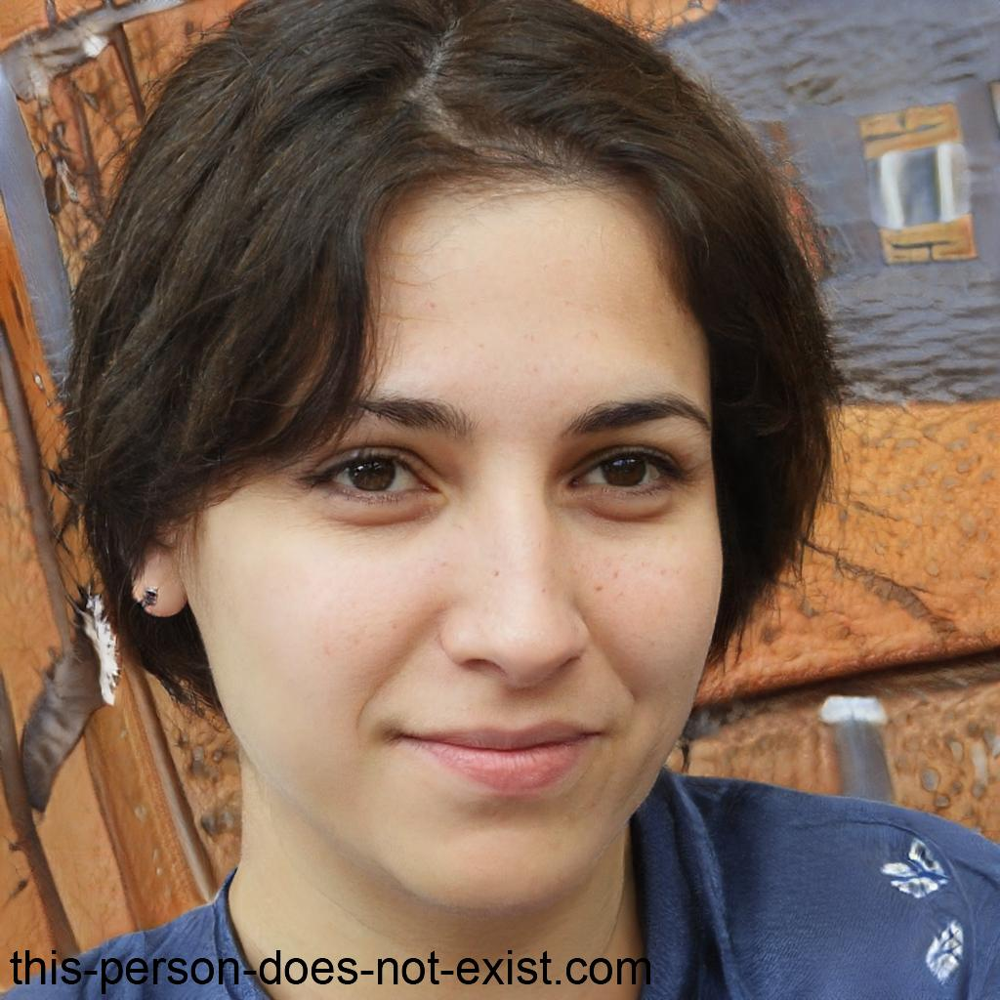
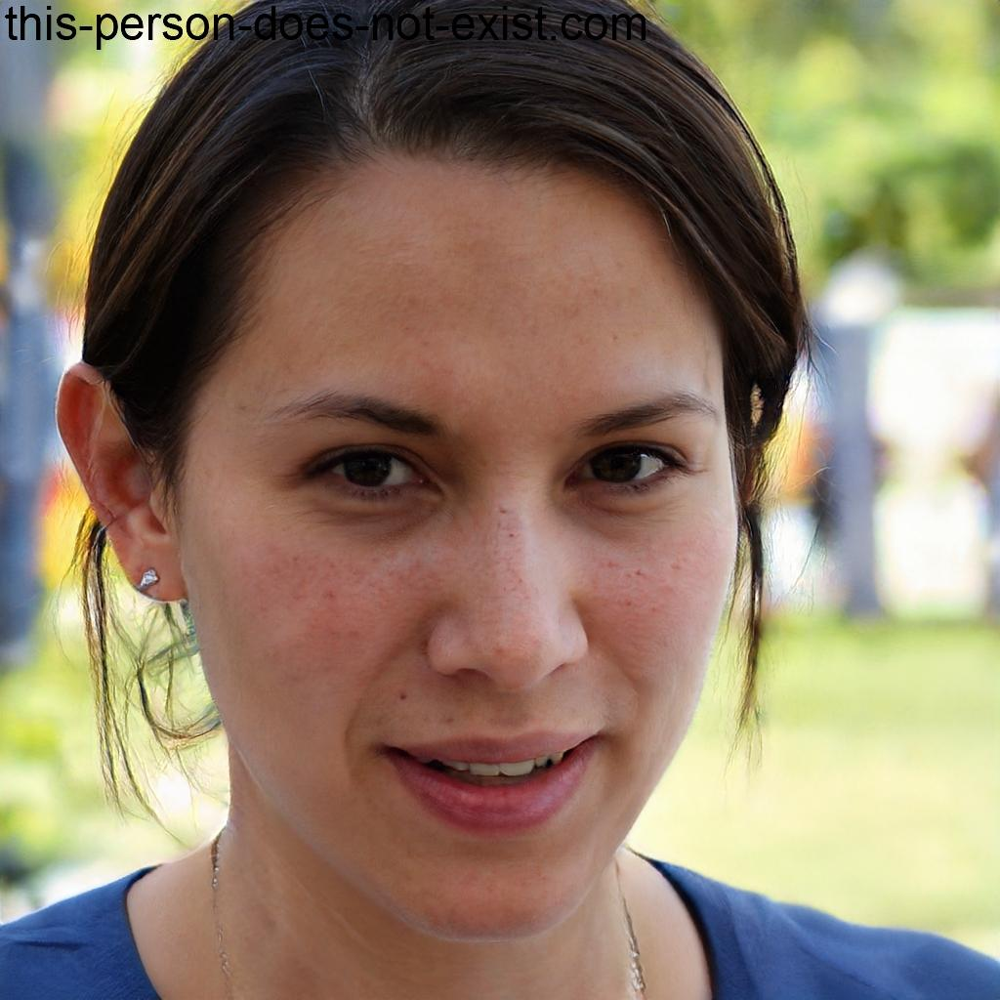
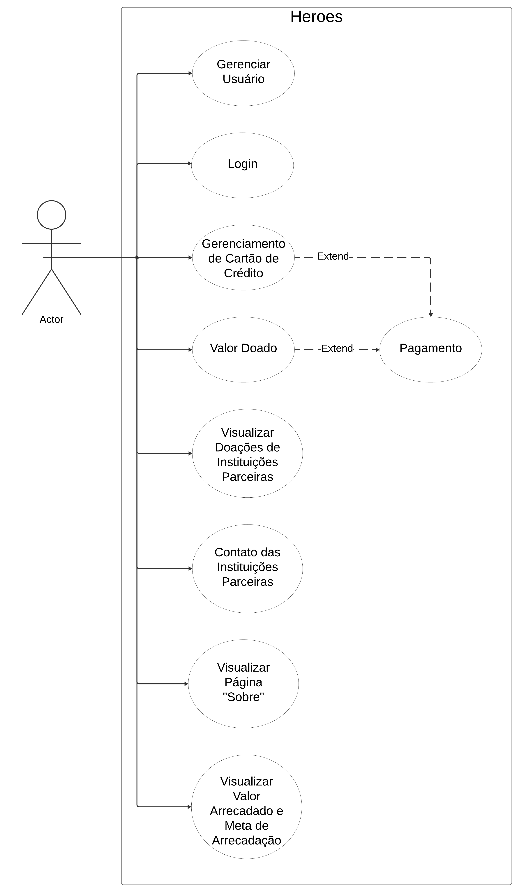
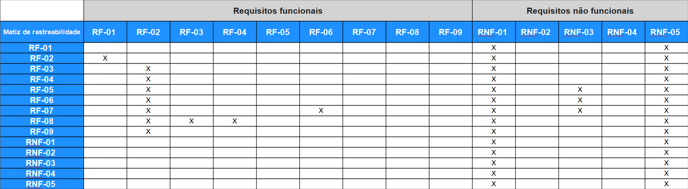

# Especificações do Projeto

Este capítulo desempenha um papel fundamental no desenvolvimento da aplicação destinada a facilitar doações aos necessitados. Apresentamos meticulosamente personas definidas, um esclarecedor diagrama de casos de uso, requisitos detalhados, uma matriz de rastreabilidade abrangente e estratégias eficazes de gerenciamento de projeto. Essa abordagem proporciona uma visão completa e integrada, onde cada elemento é cuidadosamente alinhado com nossos objetivos e metas estabelecidos, assegurando uma compreensão holística e direcionada do projeto.

## Personas

As personas levantadas durante o processo de entendimento do problema são apresentadas a seguir:

|  | Florentino Rossi| 
|-----------|------------| 
| **Idade:** | 29 anos |
| **Ocupação:** | Sociólogo |
| **Motivações:** |  Motivação principal é querer ajudar o próximo em situações de desastres  |
| **Frustrações:** | Dificuldade em ter confiança sobre o repasse dos fundos para ocs autorizadas com ajuda humanitária |
| **Aplicativos:** | *Instagram   *Facebook   *LinkedIn |
| **Como o sistema pode facilitar o trabalho?** | Facilita com transparência e segurança o envio do dinheiro para ajudar nos desastres |

|  | Sabrina Yumi | 
|-----------|------------| 
| **Idade:** | 25 anos |
| **Ocupação:** |Gerente de Projeto em uma OSCS de Conservação Ambiental |
| **Motivações:** | Sabrina é apaixonada pela preservação do meio ambiente e está empenhada em garantir o financiamento necessário para os projetos da sua organização |
| **Frustrações:** | Sabrina muitas vezes se vê sobrecarregada com a burocracia associada à obtenção de financiamento para os projetos. |
| **Aplicativos:** | *Instagram   *Facebook   *Zoom   * Twitter |
| **Como o sistema pode facilitar o trabalho?** | O sistema pode simplificar o processo de solicitação de financiamento, centralizando todas as informações necessárias em uma plataforma fácil de usar. |

|  | Ayumi Kubo | 
|-----------|------------| 
| **Idade:** | 55 anos |
| **Ocupação:** | Coordenadora de Voluntariado em uma OSCS de Saúde Pública |
| **Motivações:** | Ela busca maneiras de aumentar o envolvimento dos voluntários e garantir que a OSCS tenha os recursos necessários para realizar seus programas. |
| **Frustrações:** | Muitas vezes se sente frustada com a falta de recursos e transparência pelas empresas parceiras |
| **Aplicativos:** | *Instagram   *Facebook   LinkedIn   Vagas |
| **Como o sistema pode facilitar o trabalho?** | Pode ajudar a OSCS a arrecadar fundos para cobrir os custos associados à operação dos programas de saúde pública. |

| | Camila Schneider | 
|-----------|------------| 
| **Idade:** | 26 anos |
| **Ocupação:** | Empresária |
| **Motivações:** |  Camila Schneider acredita que um aplicativo móvel destinado a facilitar doações para situações de desastres reside na sua convicção de que a tecnologia pode ser uma ferramenta poderosa para canalizar ajuda de forma eficiente e rápida em momentos de crise.
| **Frustrações:** | Ela sente frustrada com os obstáculos técnicos e burocráticos que surgem ao tentar fazer uma simples doação.  |
| **Aplicativos:** | *Instagram   *Facebook   *Microsoft Teams   *AutoCad |
| **Como o sistema pode facilitar o trabalho?** | O sistema pode oferecer a Camila uma plataforma centralizada onde ele possa pesquisar e descobrir OSCS que atuam diretamente com ajudas com desastres |

|  | Rami Opash | 
|-----------|------------| 
| **Idade:** | 25 anos |
| **Ocupação:** | Profissional Liberal |
| **Motivações:** | Rami acredita na importância de retribuir à comunidade e está comprometido em contribuir financeiramente para ajuda com desastres |
| **Frustrações:** | Rami frequentemente experimenta frustração devido à dificuldade em localizar organizações parceiras que prestem assistência em situações de desastre. |
| **Aplicativos:** | *Instagram   *Facebook   *Whatsapp |
| **Como o sistema pode facilitar o trabalho?** | OSCS que estão fazendo um impacto significativo em questões que Rami se preocupa, fornecendo transparência sobre como suas doações serão utilizadas. |

## Histórias de Usuários

Com base na compreensão do dia-a-dia das funções identificadas para o projeto, as histórias de usuário estão documentadas a seguir:

|EU COMO... `PERSONA`| QUERO/PRECISO ... `FUNCIONALIDADE` |PARA ... `MOTIVO/VALOR`                 |
|--------------------|------------------------------------|----------------------------------------|
| Florentino Rossi | Um aplicativo de doações intuitivo e de fácil compreensão | Projetado para simplificar o processo de contribuição em poucas etapas |
| Florentino Rossi | Preferência por uma interface simples, porém abrangente | Livre de anúncios, garantindo usabilidade eficiente |
| Sabrina Yumi | A necessidade de transparência para as OSCS, facilitando o planejamento e envio dos recursos | Otimizando assim meu trabalho de envio. |
| Sabrina Yumi |  A possibilidade de acessar o histórico das transações | Promovendo transparência e confiança para os doadores |
| Ayumi Kubo | A inclusão de opções de pagamento como cartões de crédito e PIX | Visando facilitar o envio de recursos pelos colaboradores. |
| Ayumi Kubo | A importância de um sistema seguro para transmitir credibilidade aos usuários | Um sistema Robusto dando prioridade a segurança dos doadores |
| Camila Schneider | Necessidade de funcionalidades que permitam fácil acesso às OSCs parceiras | Para garantir segurança  |
| Camila Schneider| A interface ser simples e funcional para o envio de recursos| Facilitando Pessoas com pouco conhecimento a doar |
| Rami Opash | A importância de mostrar o histórico e o destino dos recursos doados |Promovendo transparência e confiança no processo de doação |
| Rami Opash | Um aplicativo que inclua parcerias com OSCS | Priorizando Transparência.  

## Modelagem do Processo de Negócio 

### Análise da Situação Atual

Apresente aqui os problemas existentes que viabilizam sua proposta. Apresente o modelo do sistema como ele funciona hoje. Caso sua proposta seja inovadora e não existam processos claramente definidos, apresente como as tarefas que o seu sistema pretende implementar são executadas atualmente, mesmo que não se utilize tecnologia computacional. 

### Descrição Geral da Proposta

Apresente aqui uma descrição da sua proposta abordando seus limites e suas ligações com as estratégias e objetivos do negócio. Apresente aqui as oportunidades de melhorias.

### Processo 1 – NOME DO PROCESSO

Apresente aqui o nome e as oportunidades de melhorias para o processo 1. Em seguida, apresente o modelo do processo 1, descrito no padrão BPMN. 

### Processo 2 – NOME DO PROCESSO

Apresente aqui o nome e as oportunidades de melhorias para o processo 2. Em seguida, apresente o modelo do processo 2, descrito no padrão BPMN.

## Indicadores de Desempenho

Apresente aqui os principais indicadores de desempenho e algumas metas para o processo. Atenção: as informações necessárias para gerar os indicadores devem estar contempladas no diagrama de classe. Colocar no mínimo 5 indicadores. 

Usar o seguinte modelo: 

Obs.: todas as informações para gerar os indicadores devem estar no diagrama de classe a ser apresentado a posteriori. 

## Requisitos

As tabelas que se seguem apresentam os requisitos funcionais e não funcionais que detalham o escopo do projeto. Para determinar a prioridade de requisitos, aplicar uma técnica de priorização de requisitos e detalhar como a técnica foi aplicada.

### Requisitos Funcionais

|ID    | Descrição do Requisito  | Prioridade |
|------|-----------------------------------------|----|
|RF-001| A aplicação deve oferecer gerenciamento de usuários | ALTA | 
|RF-002| A aplicação deve permitir que usuários pré cadastrados realizem login   | ALTA |
|RF-003| A aplicação deve permitir o gerenciamento de cartão de crédito   | ALTA |
|RF-004| A aplicação deve permitir inserir o valor a ser doado   | ALTA |
|RF-005| A aplicação deve permitir que o usuário veja todas as instituições parceiras recebendo doações   | ALTA |
|RF-006| A aplicação deve apresentar uma pagina sobre o heroes  | ALTA |
|RF-007| A aplicação deve apresentar o numero de contato das instituições parceiras   | ALTA |
|RF-008| A aplicação deve permitir a doação por cartão de crédito, pix   | ALTA |
|RF-009| A aplicação deverá mostrar a meta a ser arrecadada e quanto a instituição já arrecadou   | ALTA |

### Requisitos não Funcionais

|ID     | Descrição do Requisito  |Prioridade |
|-------|-------------------------|----|
|RNF-001| A aplicação deve utilizar um framework multiplataformas | ALTA | 
|RNF-002| A aplicação deve ter interface intuitiva e amigável, mesmo para usuários não técnicos |  ALTA |
|RNF-003| A aplicação deve ter Navegação clara e lógica, facilitando o acesso às informações |  MÉDIA |
|RNF-004| A aplicação deve ter bom nível de contraste entre os elementos da tela em conformidade |  MÉDIA |
|RNF-005| A aplicação será desenvolvida utilizando banco de dados relacional |  ALTA |

## Diagrama de Casos de Uso

# Matriz de Rastreabilidade

A matriz de rastreabilidade é uma ferramenta usada para facilitar a visualização dos relacionamento entre requisitos e outros artefatos ou objetos, permitindo a rastreabilidade entre os requisitos e os objetivos de negócio. 

A matriz deve contemplar todos os elementos relevantes que fazem parte do sistema, conforme a figura meramente ilustrativa apresentada a seguir.

# Gerenciamento de Projeto

De acordo com o PMBoK v6 as dez áreas que constituem os pilares para gerenciar projetos, e que caracterizam a multidisciplinaridade envolvida, são: Integração, Escopo, Cronograma (Tempo), Custos, Qualidade, Recursos, Comunicações, Riscos, Aquisições, Partes Interessadas. Para desenvolver projetos um profissional deve se preocupar em gerenciar todas essas dez áreas. Elas se complementam e se relacionam, de tal forma que não se deve apenas examinar uma área de forma estanque. É preciso considerar, por exemplo, que as áreas de Escopo, Cronograma e Custos estão muito relacionadas. Assim, se eu amplio o escopo de um projeto eu posso afetar seu cronograma e seus custos.

## Gerenciamento de Tempo

A gestão do tempo em um projeto é fundamental para garantir que todas as atividades sejam concluídas dentro do prazo estabelecido. É um processo que envolve a identificação e o planejamento das tarefas necessárias para atingir os objetivos do projeto, bem como a alocação eficiente dos recursos disponíveis.
Em resumo, a gestão do tempo em um projeto envolve a definição clara de metas e prazos, a identificação e priorização das tarefas mais importantes e o acompanhamento constante do progresso. Com uma gestão eficaz do tempo, é possível aumentar a produtividade, reduzir custos e garantir a entrega do projeto dentro do prazo e do orçamento previstos.

"O tempo é o recurso mais escasso e, a menos que seja gerenciado, nada mais pode ser gerenciado." - Peter Drucker

| Nome da Tarefa |  Duração  |   Início   |  Término   |
|----------------|-----------|------------|------------|
|     Projeto    |  142 Dias | 01/02/2024 | 12/07/2024 |
|     Etapa 1    |  32 Dias  | 01/02/2024 | 10/03/2024 |
|     Etapa 2    |  21 Dias  | 10/03/2024 | 31/03/2024 |
|     Etapa 3    |  21 Dias  | 01/04/2024 | 21/04/2024 |
|     Etapa 4    |  34 Dias  | 22/04/2024 | 26/05/2024 |
|     Etapa 5    |  27 Dias  | 27/05/2024 | 23/06/2024 |

O gráfico de Gantt ou diagrama de Gantt também é uma ferramenta visual utilizada para controlar e gerenciar o cronograma de atividades de um projeto. Com ele, é possível listar tudo que precisa ser feito para colocar o projeto em prática, dividir em atividades e estimar o tempo necessário para executá-las.

## Gerenciamento de Equipe

A gestão de equipe em um projeto de desenvolvimento é um processo complexo que exige habilidades de liderança, comunicação e organização. Com uma equipe bem gerenciada, é possível aumentar a produtividade, melhorar a qualidade do trabalho e alcançar os objetivos do projeto de forma eficaz.

|        Equipe         |                  Função                     |
|-----------------------|---------------------------------------------|
|    Pedro Andrade      |    Scrum Master e Desenvolvedor             | 
|    Wesley Gomes       |    PO e Desenvolvedor                       |
|    Bruno Arantes      |    Desenvolvedor                            |
|    Marcos Teixeira    |    Arquiteto de Software e Desenvolvedor    |
|    Renan Golçaves     |    Analista de Negócios e Desenvolvedor     |
|    Gustavo Candido    |    Desenvolvedor                            |

## Gestão de Orçamento

A gestão do orçamento de um projeto é um processo contínuo que exige planejamento cuidadoso, monitoramento constante e comunicação eficaz. Com uma gestão eficiente do orçamento, é possível maximizar o uso dos recursos disponíveis e garantir o sucesso do projeto dentro das restrições financeiras estabelecidas..

| Ações                        | Valores totais                  |
|------------------------------|---------------------------------|
| Desenvolvimento              |          R$23.878,59            |
| Licença Play Store           |           R$123,45              |
| Hospedagem Azure             |           R$1.093,4             |
| 6 - Desenvolvedores Salário  |           R$62.800              |
| Registro de Patente          |           R$200,00              |
| Total                        |          R$88.095,44            |
