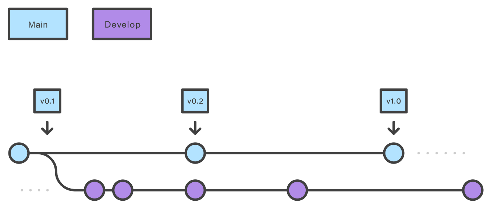
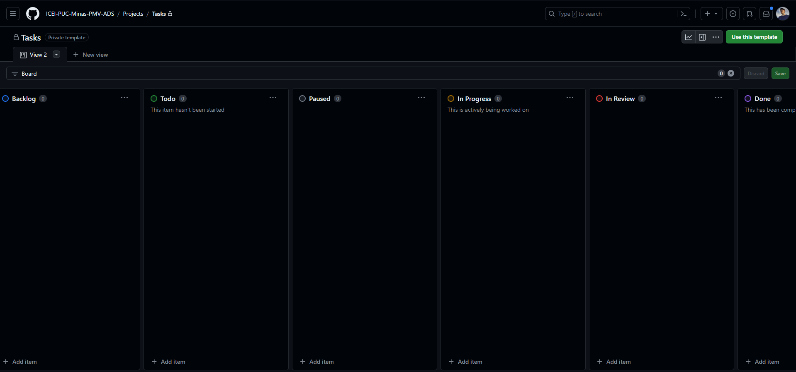

# Metodologia

Nesta seção estão apresentados o Controle de Versão e o Gerenciamento do Projeto em questão. No Controle de Versão, seguimos a metodologia GitFlow, que nos permite controlar as alterações no código e realizar testes antes de serem integradas na branch principal. Já no Gerenciamento do Projeto, utilizamos a metodologia Scrum, com sprints semanais e uma equipe de desenvolvimento e design responsáveis pela implementação e entrega das funcionalidades. Utilizamos também o GitHub Project para organizar as tarefas da equipe, com o objetivo de garantir uma gestão eficiente e organizada para o desenvolvimento do projeto.

## Relação de Ambientes de Trabalho

Os artefatos do projeto são desenvolvidos a partir de diversas plataformas e a relação dos ambientes com seu respectivo propósito deverá ser apresentada em uma tabela que especifica que detalha Ambiente, Plataforma e Link de Acesso. 
Nota: Vide documento modelo do estudo de caso "Portal de Notícias" e defina também os ambientes e frameworks que serão utilizados no desenvolvimento de aplicações móveis.

## Controle de Versão

A ferramenta de controle de versão adotada no projeto foi o Git, sendo que o Github foi utilizado para hospedagem do repositório.

O projeto segue a seguinte convenção para o nome de branches:

- `main`: versão estável já testada do software
- `develop`: versão de desenvolvimento do software

Quanto à gerência de issues, o projeto adota a seguinte convenção para
etiquetas:

- `documentation`: melhorias ou acréscimos à documentação
- `bug`: uma funcionalidade encontra-se com problemas
- `enhancement`: uma funcionalidade precisa ser melhorada
- `feature`: uma nova funcionalidade precisa ser introduzida

## Gerenciamento de Projeto

### Divisão de Papéis

Apresente a divisão de papéis entre os membros do grupo.

Exemplificação: A equipe utiliza metodologias ágeis, tendo escolhido o Scrum como base para definição do processo de desenvolvimento. A equipe está organizada da seguinte maneira:
- `Scrum Master` - Pedro Ferreira Andrade
- `Product Owner` - Bruno Henrique Arantes Dias
- `Dev Team` - Wesley, Bruno, Pedro, Marcos, Gustavo, Renan
- `Design Team` - Marcos Teixeira Dias

### Processo

A distribuição de tarefas da equipe está sendo organizada no GitHub Project, que se encontra estruturado nos seguintes tópicos:

Backlog: todas as atividades que devem ser realizadas no projeto, desde a documentação até o desenvolvimento final do site.
- `Backlog`: Apresenta todas as tarefas a serem feitas.
- `To do`: Apresenta tarefas atribuidas e que seão iniciadas.
- `In progress`: O que está sendo feito.
- `Paused`: Tarefas pausadas.
- `In Review`: O que precisa ser revisado junto ao orientador.
- `Done`: Tudo o que foi finalizado.

  

### Ferramentas

As ferramentas empregadas no projeto são:

Editor de código: Visual Code Studio
- `Ferramentas de comunicação`: WhatsApp, Discord e Microsoft Teams
- `Ferramentas de desenho de tela (interface, _wireframing_)`: Figma
- `Ferramentas de desenho de Digrama`: MySQL WorkBench, LucidChart
- 
O editor de código foi escolhido porque ele possui uma integração com o sistema de versão. As ferramentas de comunicação utilizadas possuem integração semelhante e por isso foram selecionadas. Por fim, para criar diagramas utilizamos essa ferramenta por melhor captar as necessidades da nossa solução.
