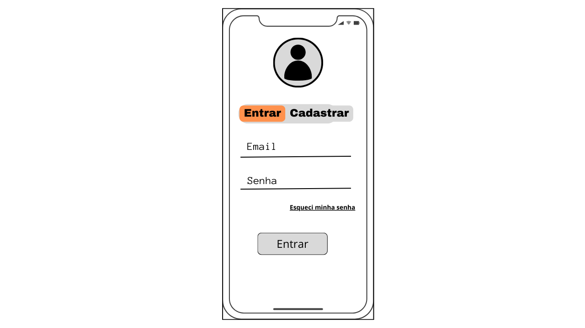
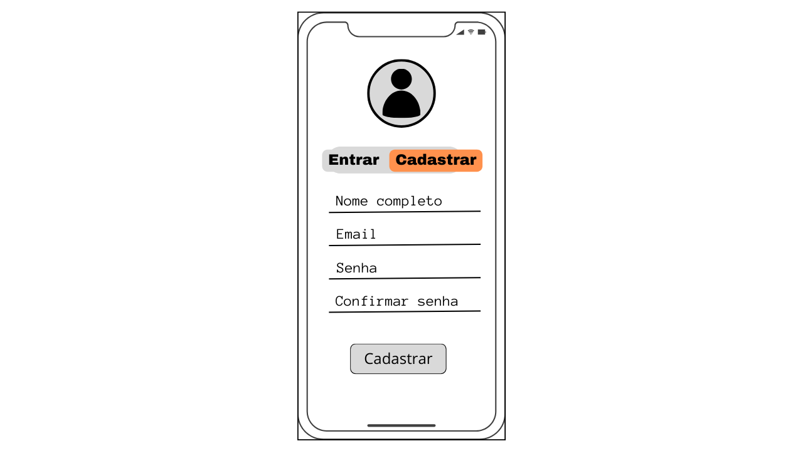
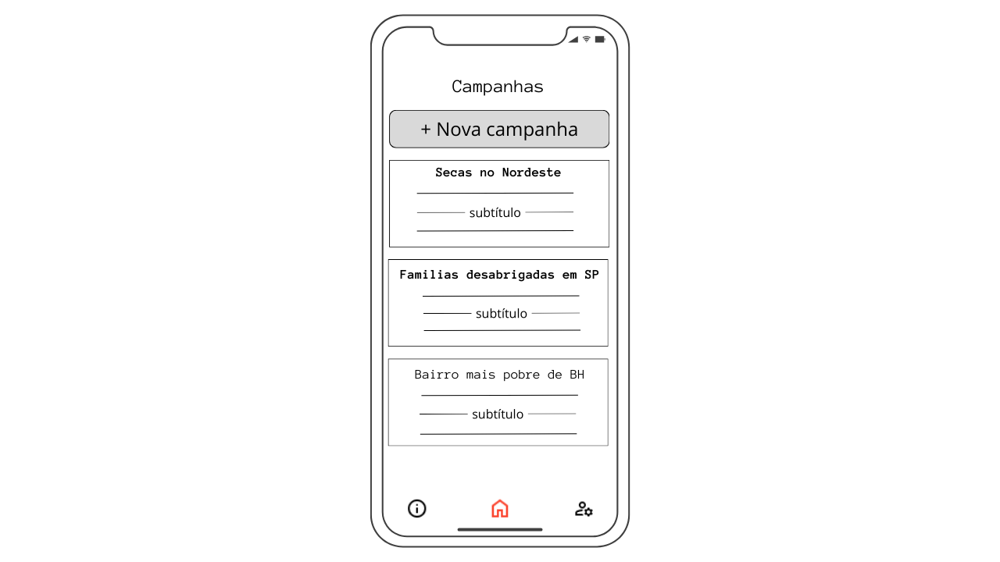
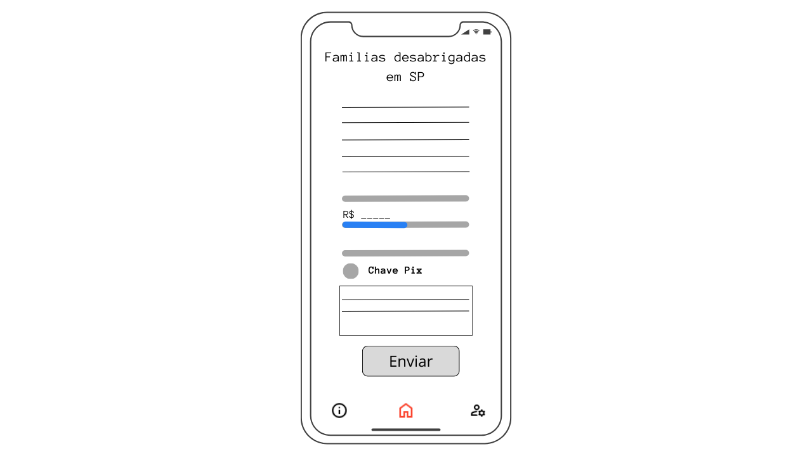
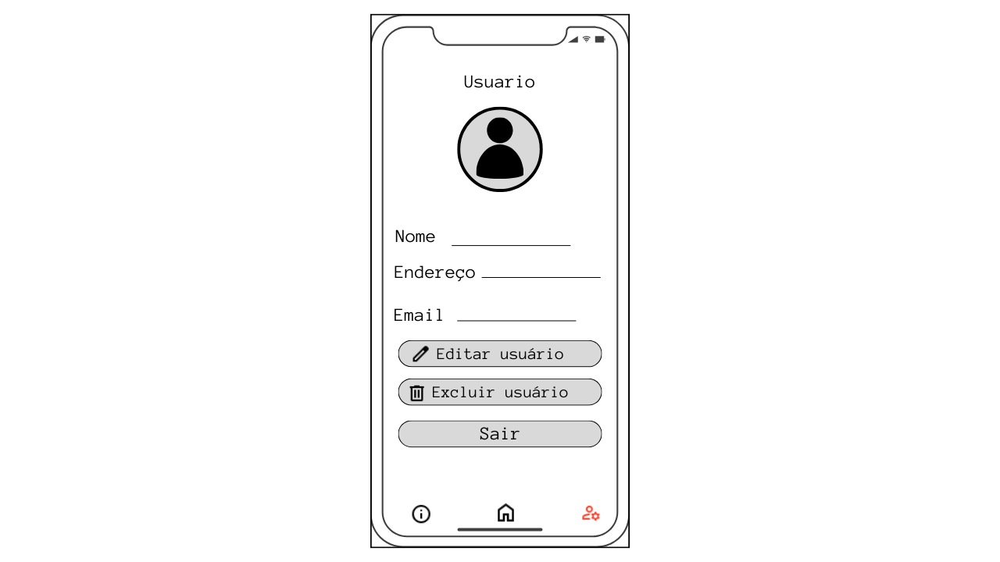
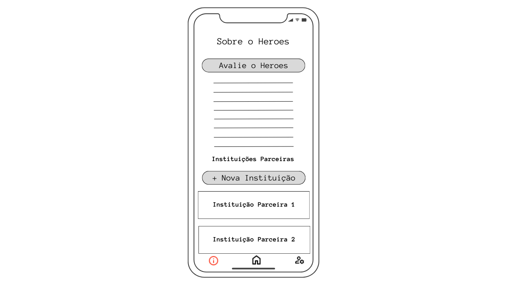
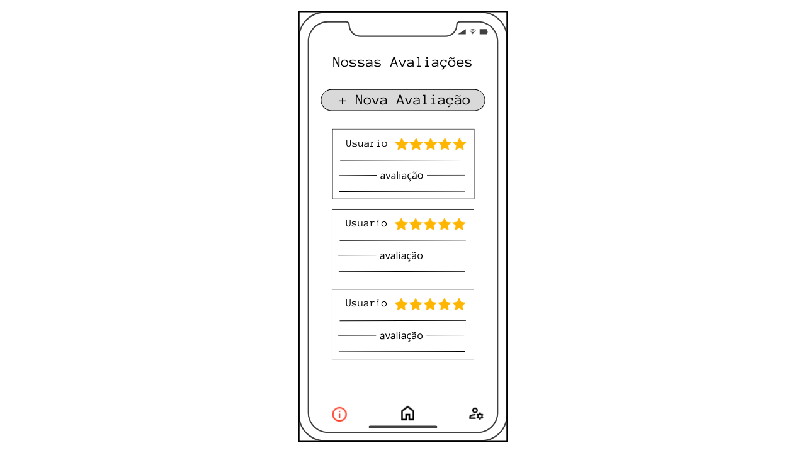
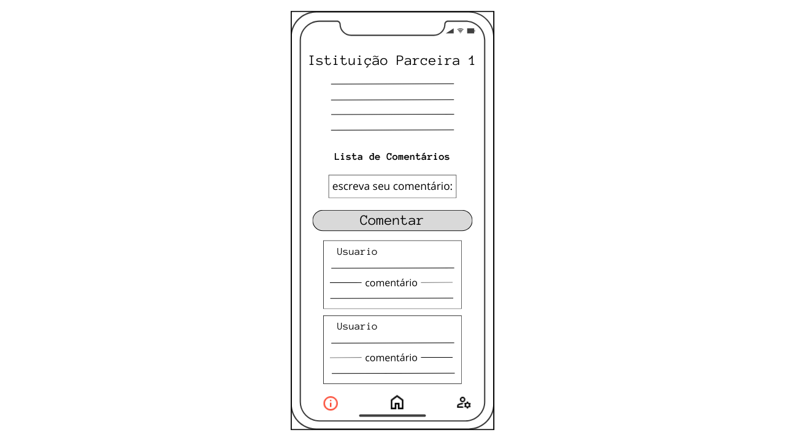
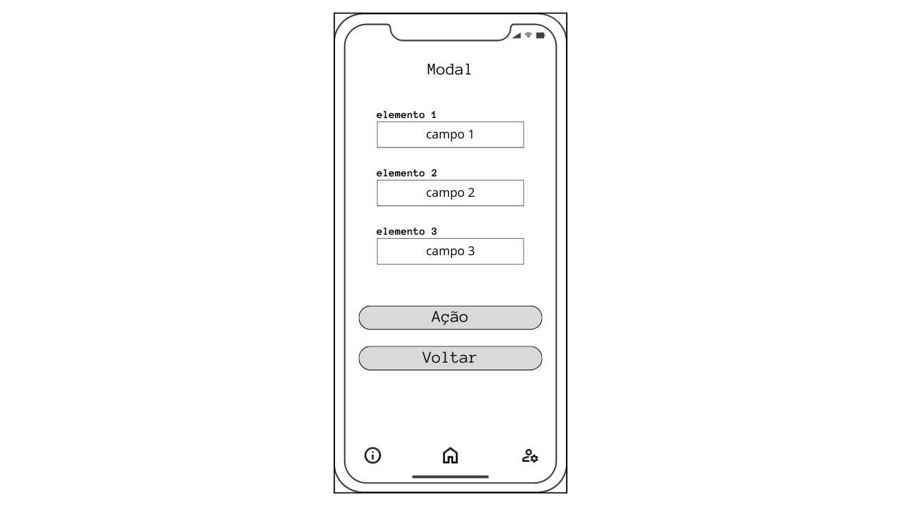

# Projeto de Interface

O projeto foi elaboradas com base nos requisitos funcionais e não funcionais mencionados. Elas apresentam uma navegação clara e simples, permitindo que o usuário interaja sem dificuldades. Esse design intuitivo visa facilitar o acesso às funcionalidades principais da aplicação, garantindo uma experiência do usuário fluida e agradável. Além disso, a organização visual e a hierarquia de informações foram cuidadosamente planejadas para assegurar que os usuários possam encontrar rapidamente o que procuram, minimizando o tempo de aprendizado e melhorando a eficiência de uso. Elementos de interface do usuário, como botões, ícones e campos de texto, foram posicionados estrategicamente para otimizar a interatividade e a acessibilidade. Com essas wireframes, pretende-se fornecer um protótipo de alta fidelidade que servirá como uma fundação sólida para o desenvolvimento subsequente, garantindo que a aplicação final não só atenda às expectativas dos usuários mas também supere-as, promovendo uma conexão mais forte e duradoura com o público-alvo.

## Diagrama de Fluxo

O diagrama de fluxo foi elaborado para representar de forma visual e sistemática o fluxo de interação do usuário com a aplicação. Ele mapeia as diferentes etapas e caminhos que um usuário pode seguir ao utilizar a aplicação, desde o momento em que acessa até a conclusão de uma determinada tarefa ou objetivo. Esse diagrama é uma ferramenta essencial para entender e comunicar de maneira clara e concisa como a aplicação funciona, identificando pontos de decisão, possíveis desvios e retornos ao longo do processo.

  Figura 01 - Diagrama de Fluxo 

## Wireframes

## Tela login
Na tela de login, o usuário fornecerá seu email e senha da conta e, em seguida, poderá clicar em "Entrar". Se o usuário ainda não tiver uma conta, ele terá a opção de se cadastrar clicando no botão indicativo.

 Figura 04 - Tela login 

## Tela cadastrar
O usuário poderá se cadastrar no aplicativo fornecendo seus dados pessoais, como e-mail, nome completo, senha e a resposta para a pergunta de segurança.

  Figura 05 - Tela cadastrar 

## Tela Principal
Na tela principal, serão apresentados os principais acontecimentos do país relacionados a desastres naturais e regiões em estado de alerta devido a situações de vulnerabilidade social. O usuário poderá interagir com os cards e selecionar o destino de sua doação.

   Figura 02 - Tela Inicial 

## Tela de doação
Na tela de doação, o usuário terá a oportunidade de compreender detalhes sobre a situação mencionada nos cards. Caso deseje efetuar uma doação, basta informar o valor a ser doado, copiar a chave-pix e clicar no botão "Enviar".

  Figura 03 - Tela doação 

## Tela perfil 
Após realizar o login, os dados do usuário serão exibidos nesta tela, permitindo a edição de seus dados pessoais, excluir sua conta e efetuar logout.

  Figura 06 - Tela perfil 

## Tela "Sobre" da aplicação
O usuário poderá obter detalhes sobre a aplicação, avaliações e as instituições que estão envolvidas também.

  Figura 11 - Tela Sobre 

## Tela Avaliações da aplicação
O usuário poderá visualizar e realizar avaliações em relação a sua experiência com o app.

  Figura 11 - Tela avaliações 

## Tela Instituições Parceiras
O usuário poderá obter detalhes sobre as instituições envolvidas, além de visualizar e enviar comentários e sujestôes para cada uma delas.

  Figura 11 - Tela instituições 

## Tela Modal
Essa tela representa o layout padrão utilizado para os modais da aplicação. Neles os usuários poderão realizar as ações de criar e editar nas funcionalidades disponíveis.

  Figura 11 - Tela modal 
