# Projeto de Interface

O projeto foi elaboradas com base nos requisitos funcionais e não funcionais mencionados. Elas apresentam uma navegação clara e simples, permitindo que o usuário interaja sem dificuldades. Esse design intuitivo visa facilitar o acesso às funcionalidades principais da aplicação, garantindo uma experiência do usuário fluida e agradável. Além disso, a organização visual e a hierarquia de informações foram cuidadosamente planejadas para assegurar que os usuários possam encontrar rapidamente o que procuram, minimizando o tempo de aprendizado e melhorando a eficiência de uso. Elementos de interface do usuário, como botões, ícones e campos de texto, foram posicionados estrategicamente para otimizar a interatividade e a acessibilidade. Com essas wireframes, pretende-se fornecer um protótipo de alta fidelidade que servirá como uma fundação sólida para o desenvolvimento subsequente, garantindo que a aplicação final não só atenda às expectativas dos usuários mas também supere-as, promovendo uma conexão mais forte e duradoura com o público-alvo.

## Diagrama de Fluxo

O diagrama de fluxo foi elaborado para representar de forma visual e sistemática o fluxo de interação do usuário com a aplicação. Ele mapeia as diferentes etapas e caminhos que um usuário pode seguir ao utilizar a aplicação, desde o momento em que acessa até a conclusão de uma determinada tarefa ou objetivo. Esse diagrama é uma ferramenta essencial para entender e comunicar de maneira clara e concisa como a aplicação funciona, identificando pontos de decisão, possíveis desvios e retornos ao longo do processo.

Acesse o link do arquivo: [Miro](https://miro.com/app/board/uXjVNg5AUIo=/?share_link_id=200163446410)

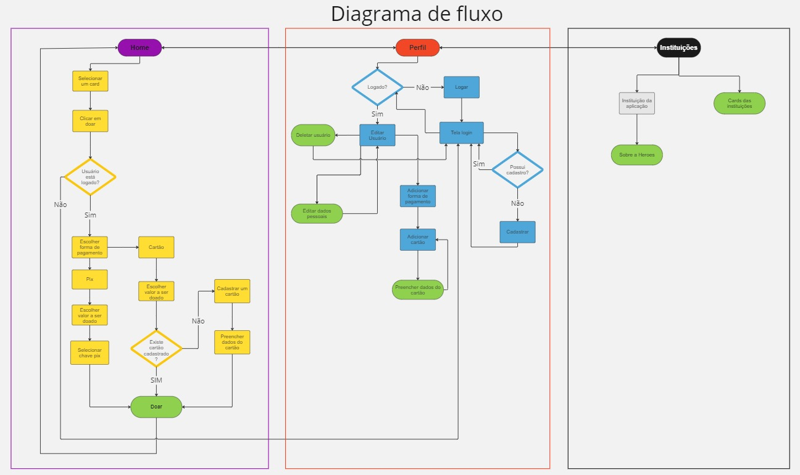  Figura 01 - Diagrama de Fluxo 

As referências abaixo irão auxiliá-lo na geração do artefato “Diagramas de Fluxo”.

## Wireframes

## Tela Principal
Na tela principal, serão apresentados os principais acontecimentos do país relacionados a desastres naturais e regiões em estado de alerta devido a situações de vulnerabilidade social. O usuário poderá interagir com os cards, selecionando o destino de sua doação.

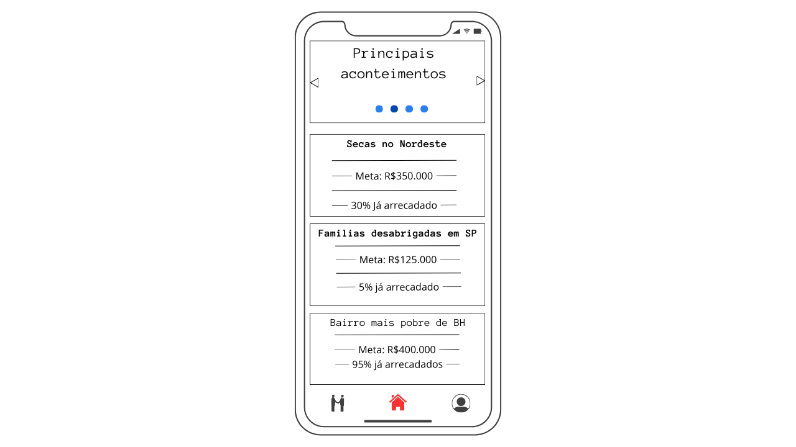  Figura 02 - Tela Inicial 

## Tela de doação
Na tela de doação, o usuário terá a oportunidade de compreender detalhes sobre a situação mencionada nos cards. Caso deseje efetuar uma doação, basta clicar no botão "Doar".

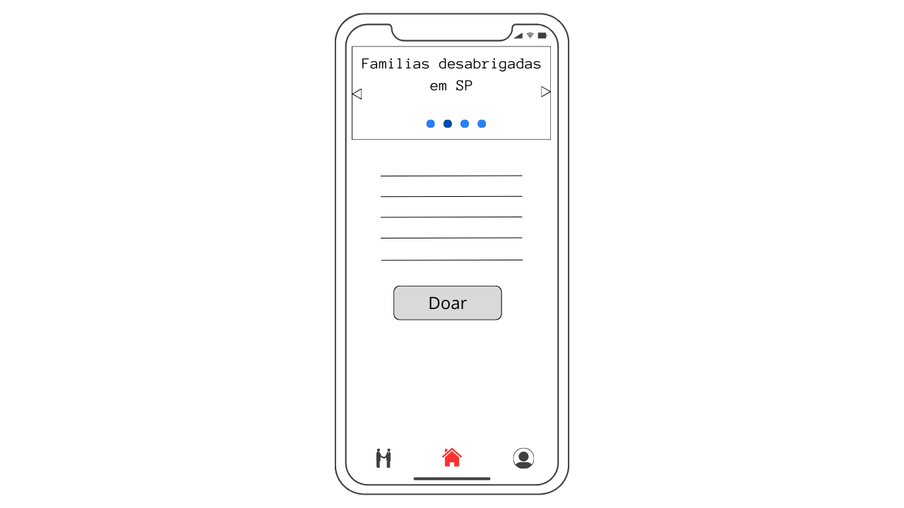  Figura 03 - Tela doação 

## Tela formas de pagamentos

Será apresentado um modal com opções de formas de pagamento. O usuário poderá optar por pagar via Pix ou com cartão de crédito.

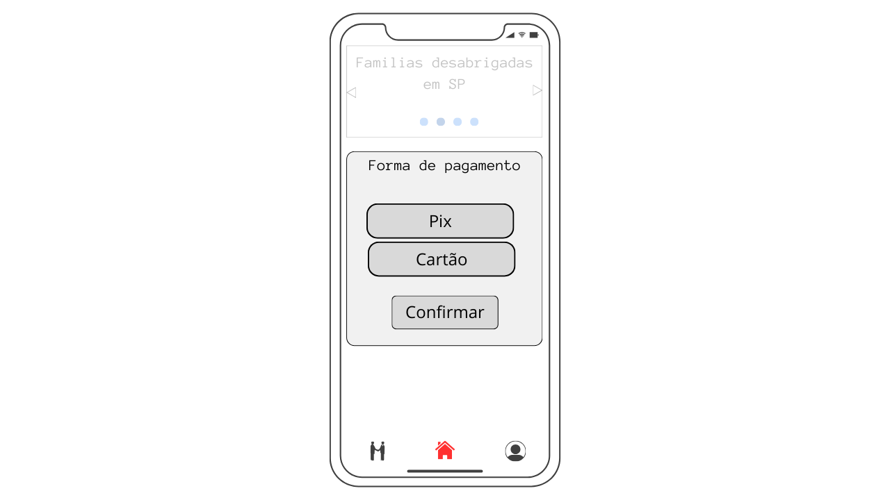  Figura 04 - Tela pagmentos  

## Tela valor da doação
Será exibido um modal que permite ao usuário selecionar o valor que deseja doar.

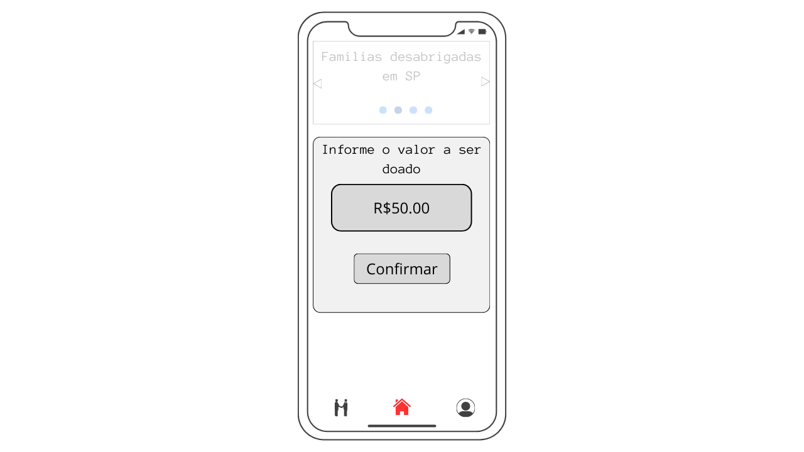  Figura 05 - Tela doação 

## Tela Perfil - Logar
Caso o usuário acesse o aplicativo sem estar logado, será apresentada a opção para realizar o login.

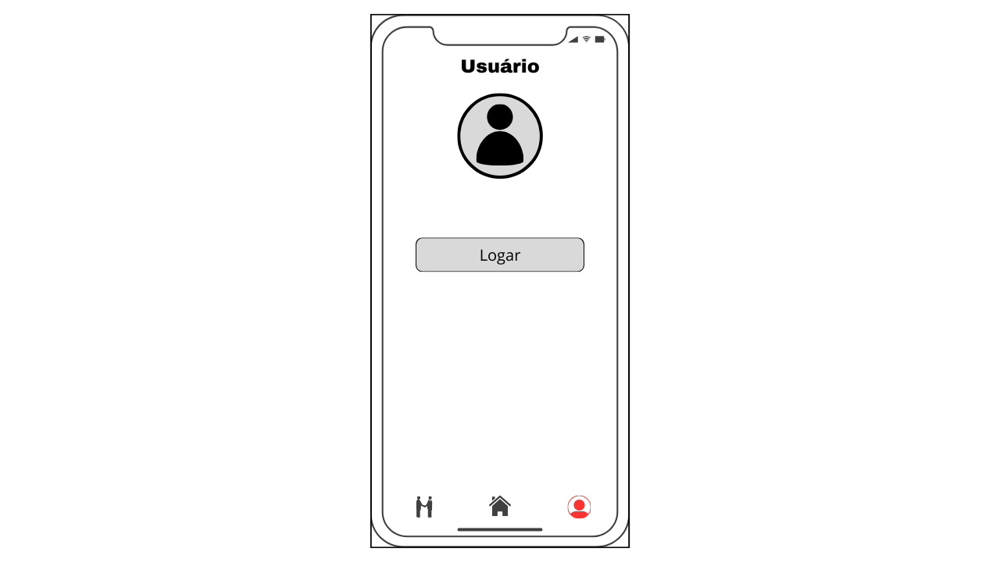  Figura 06 - Tela perfil - logar 

## Tela login
Na tela de login, o usuário fornecerá seu nome de usuário e senha da conta e, em seguida, poderá clicar em "Logar". Se o usuário ainda não tiver uma conta, ele terá a opção de se cadastrar clicando no botão indicativo.

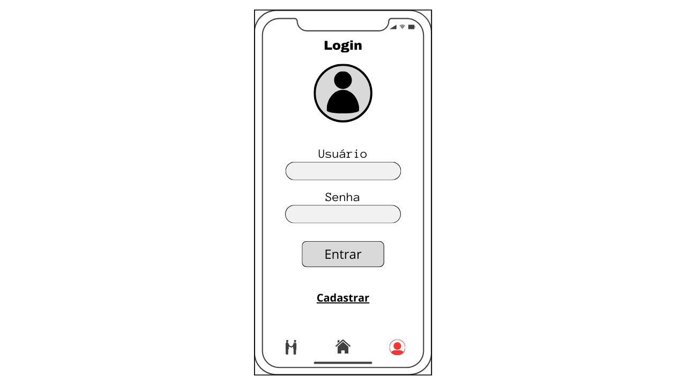  Figura 07 - Tela login 

## Tela cadastrar
O usuário poderá se cadastrar no aplicativo fornecendo seus dados pessoais, como e-mail, nome de usuário e senha.
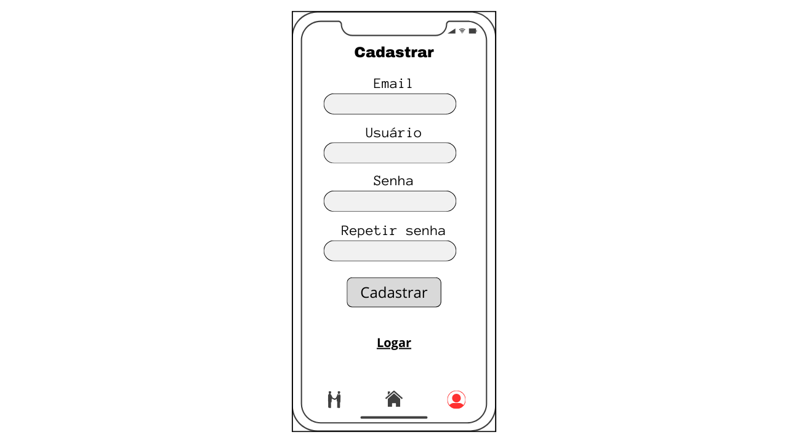  Figura 08 - Tela cadastrar 

## Tela perfil - Logado
Após realizar o login, os dados do usuário serão exibidos, permitindo a adição de um meio de pagamento e a edição de seus dados pessoais.

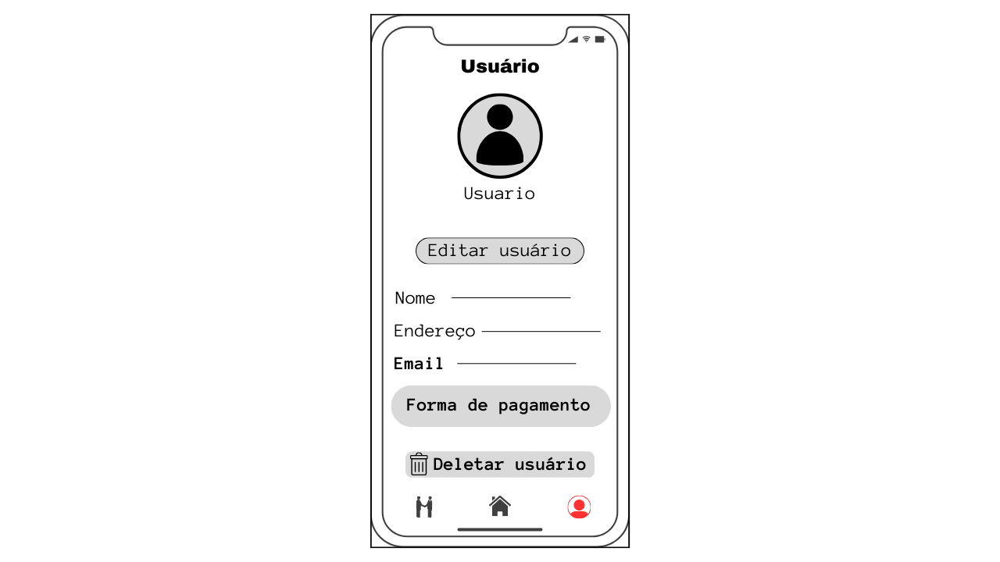  Figura 09 - Tela logado 

## Tela editar pefil
O usuário poderá editar seus dados pessoais simplesmente fornecendo as informações solicitadas nos campos correspondentes.

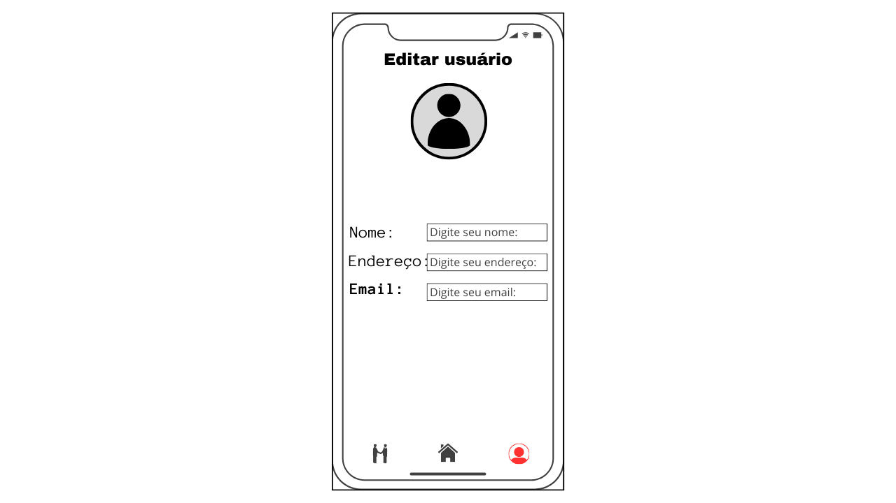  Figura 10 - Tela perfil 

## Tela adicionar cartão
O usuário terá a opção de adicionar um cartão de crédito para facilitar pagamentos futuros.

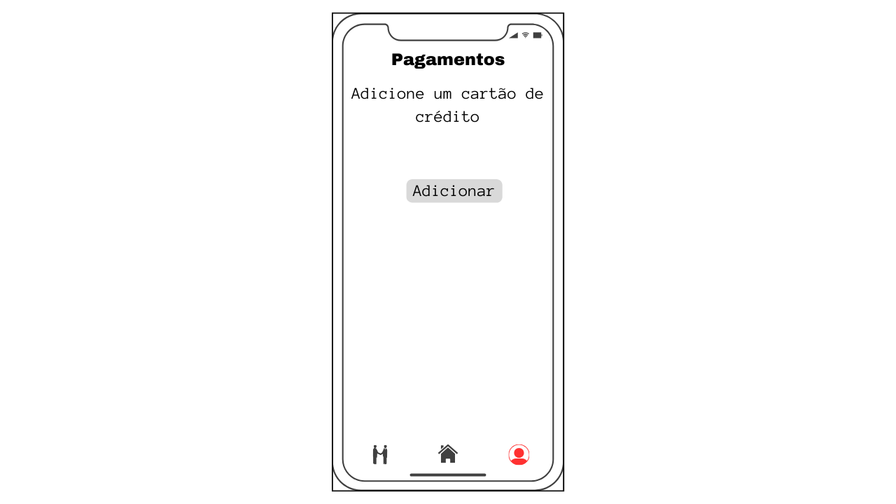  Figura 11 - Tela adicionar cartão 

## Tela dados do cartão
Ao clicar na opção de adicionar cartão, o usuário preencherá os dados do cartão de crédito necessários para concluir a operação.

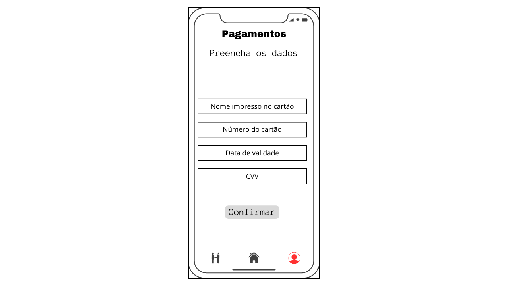  Figura 12 - Tela dados do cartão 

## Tela Pagamentos
Os cartões adicionados serão exibidos na tela de pagamentos, onde será possível adicionar um novo cartão ou removê-los conforme necessário.

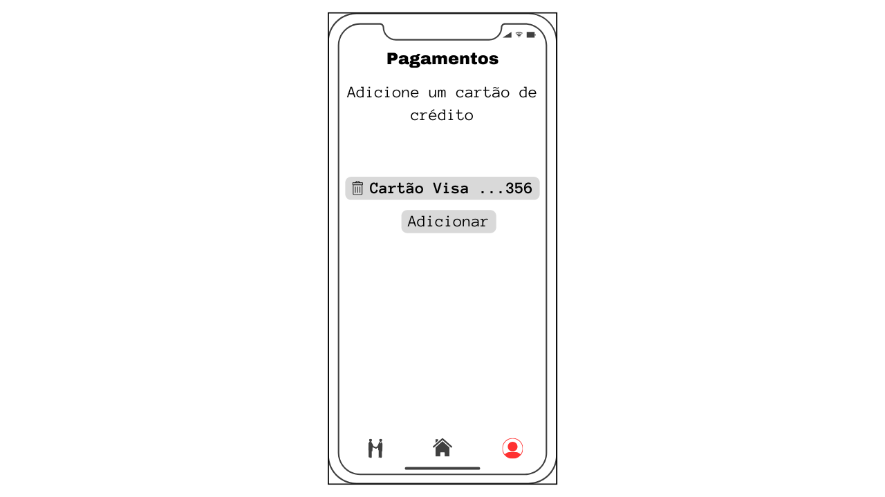  Figura 13 - Tela pagamentos 

## Tela instituições
Na tela de instituições, serão apresentadas todas as instituições parceiras do canal de doações.

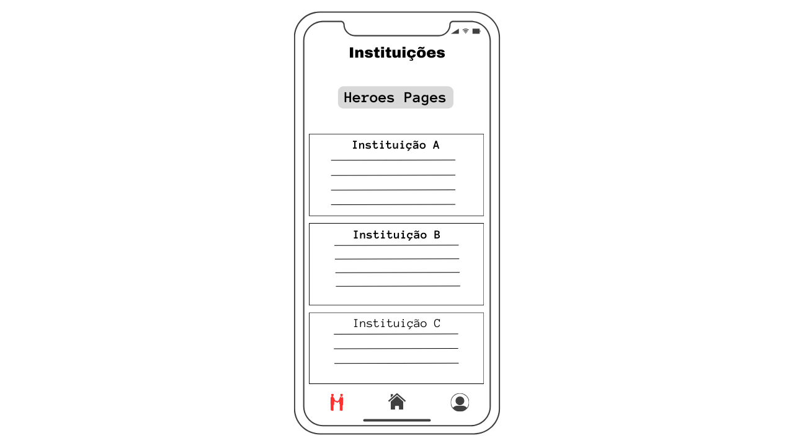  Figura 14 - Tela instituições 

## Tela detalhes da instituição da aplicação
O usuário poderá obter detalhes sobre a instituição na aplicação, incluindo endereço, contato, valor total arrecadado e motivações.

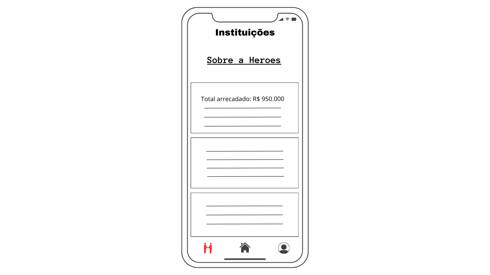  Figura 15 - Tela instituição da aplicação 

<!-- São protótipos usados em design de interface para sugerir a estrutura de um site web e seu relacionamentos entre suas páginas. Um wireframe web é uma ilustração semelhante do layout de elementos fundamentais na interface. -->
 
<!-- > **Links Úteis**:
> - [Protótipos vs Wireframes](https://www.nngroup.com/videos/prototypes-vs-wireframes-ux-projects/)
> - [Ferramentas de Wireframes](https://rockcontent.com/blog/wireframes/)
> - [MarvelApp](https://marvelapp.com/developers/documentation/tutorials/)
> - [Figma](https://www.figma.com/)
> - [Adobe XD](https://www.adobe.com/br/products/xd.html#scroll)
> - [Axure](https://www.axure.com/edu) (Licença Educacional)
> - [InvisionApp](https://www.invisionapp.com/) (Licença Educacional) -->
